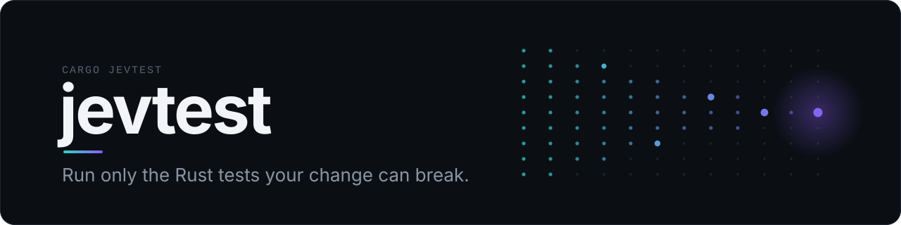
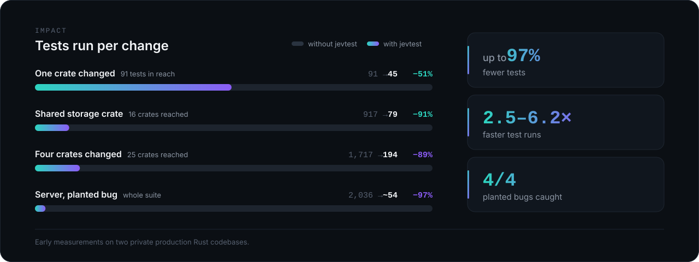
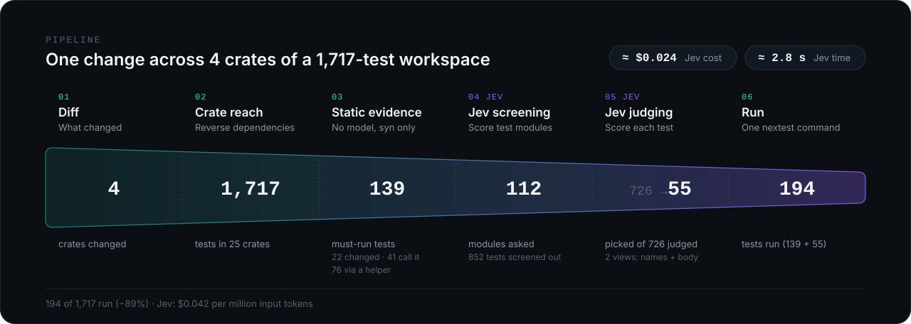

<p align="center"></p>

# jevtest

**Rust test selection for AI coding agents: run only the affected tests (cargo nextest or cargo test), with test impact analysis backed by AI.**

<p align="center"><b>up to 97% fewer tests · 2.5–6.2× faster test runs · 4/4 planted bugs caught · ≈ 0.2–2.4¢ per change · ≤ 3 s to select</b></p>

Big Rust workspaces have thousands of tests, and coding agents rerun all of them after every edit.
jevtest runs only the tests a change can break and prints one test command. Measured on two private
production Rust codebases (early, small samples):

<p align="center"></p>

| Change (1,717-test, 25-crate workspace) | Crate reach | jevtest | Jev cost | Jev time |
|---|---:|---:|---:|---:|
| One crate | 91 | 45 | ≈ $0.002 | 0.9 s |
| Shared storage crate (16 crates reached) | 917 | 79 | ≈ $0.011 | 1.4 s |
| 4 crates (25 reached) | 1,717 | 194 | ≈ $0.024 | 2.8 s |

On a 2,036-test Rust server with 4 planted bugs, jevtest's selection method (top 30 by names ∪ top 30
by body) caught all 4 running 50–58 tests; runs went from 153–211 s to 32–83 s.

## How it works

<p align="center"></p>

Crate reach finds the packages a diff can affect. `syn` static evidence makes tests that name or call
what changed must-runs. TypeSafe Jev ranks the rest by how likely the diff is to break them, and the
top picks plus every must-run become one `cargo nextest` (or `cargo test`) command.

## Paste this to your coding agent

```text
Integrate jevtest (https://github.com/aramalipoor/rust-jevtest) into this Rust project. Read its
docs/agents.md first. Then: `cargo install jevtest --locked` (plus cargo-nextest if missing),
run `cargo jevtest doctor` and fix what it reports (a missing API key is fine), run
`cargo jevtest init` and paste the AGENTS.md block it prints into AGENTS.md, add [[rule]]s for
paths jevtest cannot see (migrations, fixtures, macro-generated tests). From now on run
`cargo jevtest run` before finishing any change. Keep the full suite for releases and CI.
```

## For agents

```sh
cargo install jevtest --locked     # provides `cargo jevtest` and `jevtest`
cargo jevtest doctor               # git, cargo metadata, runner, key, one tiny Jev call
cargo jevtest init                 # writes jevtest.toml, prints the AGENTS.md block to paste
cargo jevtest run                  # select + run; exit code = the test runner's
cargo jevtest --format json        # the full selection report on stdout
cargo jevtest explain <PATTERN>    # why each matching test was picked or skipped
```

What changed: by default your uncommitted work; with a clean tree, the branch vs the default branch, or
the last commit on it. Choose exactly with `--uncommitted`, `--branch`, `--last 3`, `--since today` or
`--files src/x.rs`. One stderr line says what was chosen ([details](docs/agents.md#choosing-what-changed)).

Key (optional): `TYPESAFE_API_KEY`, `AI_GATEWAY_API_KEY`, or `~/.config/jevtest/typesafe.key`.

**Safe by default**

- No key or Jev down → runs every test in the reached crates; never an error.
- No cargo-nextest → falls back to `cargo test` with one notice.
- `Cargo.toml`, `Cargo.lock` or toolchain changes → full run.
- Tests you changed always run.

Full agent guide: [docs/agents.md](docs/agents.md) (doctor checks, AGENTS.md block, key setup, the 9
selection layers, every config key, outputs, CI, cost, troubleshooting, limits).

MIT OR Apache-2.0 ([LICENSE-MIT](LICENSE-MIT), [LICENSE-APACHE](LICENSE-APACHE)).
